# World War BATTLES!

World War Battles is a Python terminal game, which runs in the Code Institute mock terminal on Heroku.

It is a single player game, where a player is playing against the computer to find its hidden ships. All ships have to be sunk to win the game.

[Here is the live version of my project](https://world-war-battles-c242ecc67e54.herokuapp.com/)

## How To Play Game

The game uses Legends which help a player know when a hit or miss takes place. An `X` is used to mark a hit, so when a ship is hit, the 'O' placeholder will be replaced by an `X`. A `&` represents the ships, it marks the position in which the ship is located. `O` is used as a placeholder. The `-` is used when a player unfortunately missed the ship, and that means a loss.

The player as well as the computer take turns in guessing where the ship of the opponent is located in order to win. Once an oponent makes a correct guess, then they win. 

## Features
### Existing Features
- When the game game starts running, a player will be prompted to insert their name. 
- A welcome message with the player's name will appear. Please see below screen print:

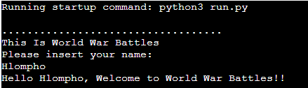
- On enter, two boards will appear.
- The player's initial board which shows where the ships are located. 
- These ships are only visible to the player and they appear randomly.
- The ships of the computer's initial are not visible. 
- The game is set to create a board of 5 rows and columns. The size of the board determines how many ships will appear on each board. Please see screen print below:

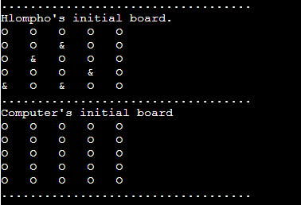

- A player will be prompted to guess where the ships are located on the computer board.
- The computer will automatically guess as well. Please see screen print below:

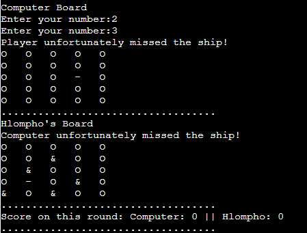

- When a string is added in the place of an integer when making a guess of the ship location, the game shows an error message then prompts a player to insert a number. Please see screen below:

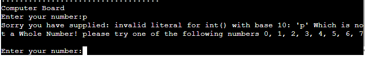

- Once a player or the computer have inserted their guesses, a message will pop up informing the player if they hit or missed the ship.
- At the bottom of each round scores will appear. Please see below screen:

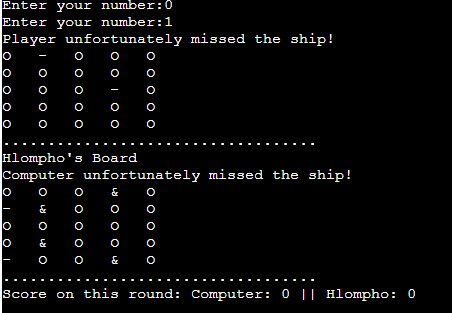

Each game has 5 rounds.

- If a player guesses the same spot repeatedly, an error will pop up. Please see below screen:

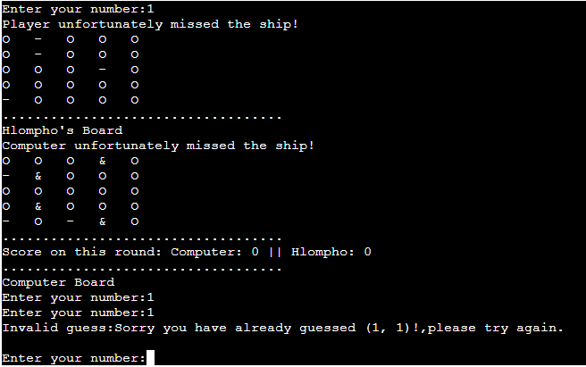

- When a player hits the oponents ship, an 'X' will overwrite the 'O' placeholder. Please see screen below:

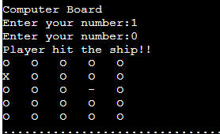

- Scores will increase each time a hit is made. Please see screen below:

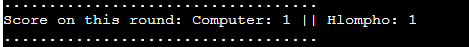

- When the 5 rounds are over, a message will appear at the bottom of the screen informing a player that their rounds are done, which means the game is over.
- The player will then have to click on the 'Run Program' button to start a new game. Please see below screen:

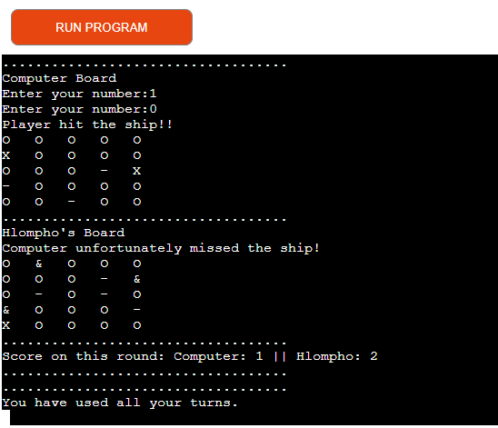

### Features To Be Implemented

- Allow player to choose their desired board size.
- A feature to validate the player's name

## Testing

I have manually tested my code using PEP8 Python Validator.
* The results given: too many blank line, my code has many missing spaces after the ',' especially inside parenthesis's, and some lines are too long. Please see screen below:

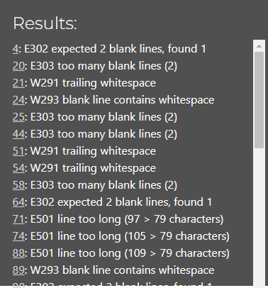

### Bugs
A board could not be created as it was not defined properly. It was not set properly

In order to check if the game is running, I had used a list as seen on the below screen shot to tell if the ships have been hit or not. I used ‘!’ exclamation marks as placeholders, however my Mentor advised I use a different legend for good user experience. Please see below for previous matrix:

### Unfixed bug
- Player name validation.
    - When a player inserts something either than a string, the game continues. Please see screen below:

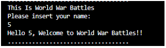

### Validator Testing
- No errors were returned from PEP8online.com

## Deployment
This project was deployed using Code Insitutte's mock terminal for Heroku.

- Steps for deployment:
    - Fork or clone this repository
    - Create a new Heroku App
    - Set the buildbacks to Python and NodeJS in that order
    - Link the Heroku app to the repository
    - Click on Deploy

## Credits
* For a better understanding of creating a Battleships game [Knowledge Mavens](https://www.google.com/search?q=how+to+make+a+simple+battleship+game+in+python&sca_esv=8c3f90bc5e947fd3&ei=eBfoZq3IDoy0hbIPvszCkQU&oq=how+to+create+battleship+game+in+python&gs_lp=Egxnd3Mtd2l6LXNlcnAiJ2hvdyB0byBjcmVhdGUgYmF0dGxlc2hpcCBnYW1lIGluIHB5dGhvbioCCAEyBhAAGBYYHjIGEAAYFhgeMgsQABiABBiGAxiKBTILEAAYgAQYhgMYigUyCBAAGIAEGKIEMggQABiABBiiBDIIEAAYgAQYogQyCBAAGIAEGKIESLNjUOUGWJ8VcAF4AJABAJgBlwOgAaghqgEGMy0xMC4yuAEByAEA-AEBmAICoAKuA8ICChAAGLADGNYEGEeYAwCIBgGQBgiSBwUxLjQtMaAHpTs&sclient=gws-wiz-serp#fpstate=ive&vld=cid:3353d00c,vid:tF1WRCrd_HQ,st:0)
* Code Institute for the deployment terminal.
* Matt Rudge's Ultimate Battleships walkthrough for the structure of the game.
* Vusi Sibeko, former Code Institute student, with validating coordinates.
* Roman, Tutor CI, reminded me to call my functions in order for game to run

