# World War BATTLES!

World War Battles is a Python terminal game, which runs in the Code Institute mock terminal on Heroku.

It is a strategy type guessing game, where a player is playing against the computer to find its hidden ships. All ships have to be sunk to win the game.

[Here is the live version of my project](https://world-war-battles-c242ecc67e54.herokuapp.com/)

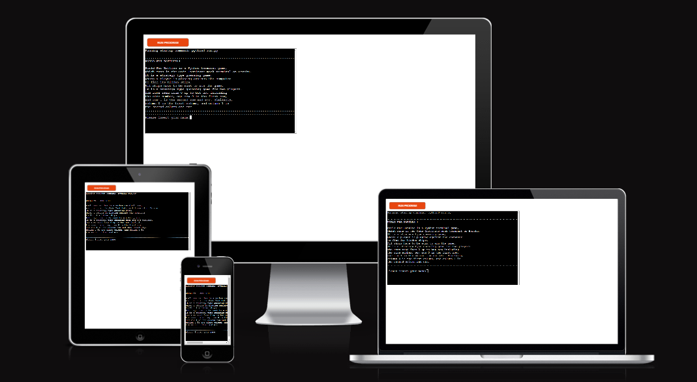

## How To Play Game

The game uses four symbols in which I would call Legends as placeholders:
    - `O` as placeholders of the board,
    - `X` used to mark a ship that is 'Hit',
    - `&` used to mark the player ships, and
    - `-` used to mark the guessed spots that 'Missed' a ship.

This is a single player, where a human plays with the computer. Both parties are given a chance to make their guesses as to where the oponents ships are located on the board. A player is given an opportunity to select preferred grid size. The selected size will have the same amount of hidden ships. The number of rounds a game has, is dependent on the size of the board. Both players will be graded on a score board and when the game is over, both scores will be visible.

This game has no specific target market, anyone who is interested can play it. If you are interested in playing a game that is unpredictable, then you are in for a treat. ENJOY!!

## Features
### Existing Features
#### Welcome Message
- At the top of the screen, an intoduction of the game is made visible for the player to read.
- When the game starts running, a player is prompted to insert their name 

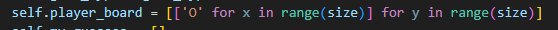

#### Player Name

- At enter, a welcome message with the player's name will appear
- Immediately after that, they are now prompted to insert the desired board size. Please see below screen print:

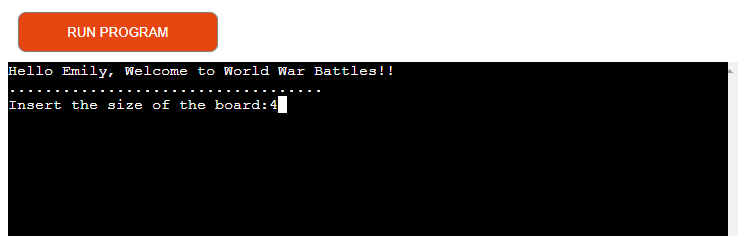

#### Initial Boards

- On enter, two boards will appear with the same selected size number.
- The player's initial board which shows where the ships are located. 
- These ships are only visible to the player and they appear randomly.
- The ships of the computer's initial board are not visible. 
- The size of the board determines how many ships will appear on each board. Please see screen print below:

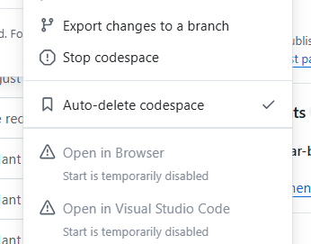

#### Guess Ship Location 

- The rounds each player has is depended on the board size.
- A player will be prompted to guess where the ships are located on the computer board.
- The computer will automatically guess as well.
- Once a player or the computer have inserted their guesses, a message will pop up informing the player if they hit or missed the ship.
- At the bottom of each round scores will appear. Please see below screen: 

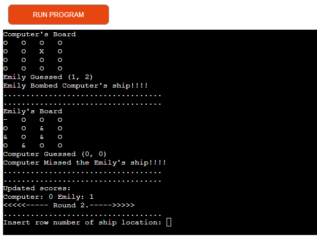

#### Game Over

- Scores will increase each time a hit is made.
- When a player hits the oponents ship, an 'X' will overwrite the 'O' placeholder.
- When the turns are finished, the final scores will appear, a message informing the players that the game is over will appear and the Game Over message will appear.
- A player will then have to click on the 'Run Program' button to start a new game. Please see below screen:

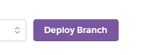

### The Name Feature
- A player is expected to insert their name to play.
- If a player does not add a valid name or leave a blank space, a value error will appear
- If a player adds a number instead of letters, a value error will pop up.
- A player will then be prompted to insert a name. Please see below image:

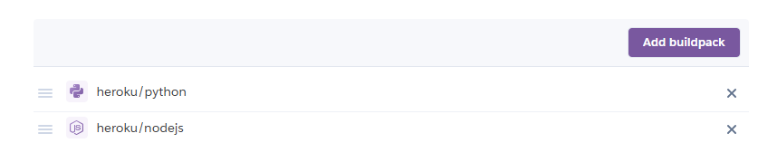

### Choose Board Size Feature
- A player will be welcomed with a personalised Welcome message
- They will be prompted to insert a desired board size
- If a player inserts an alphabet instead of a number, an error will apear. Please see image below:

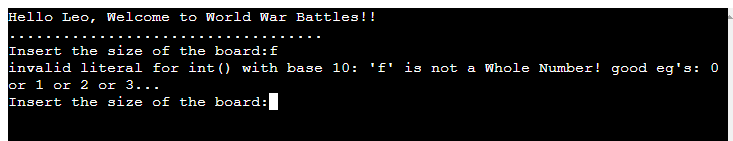

- If a number is inserted correctly, two initial boards will appear.
- A board for the player 

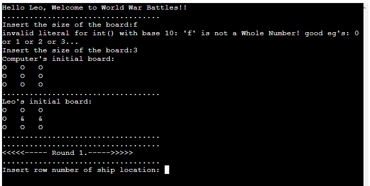

### 

<!-- - When a string is added in the place of an integer when making a guess of the ship location, the game shows an error message then prompts a player to insert a number. Please see screen below:

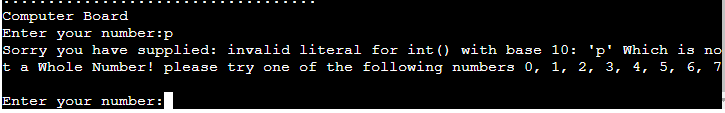 -->

### Features To Be Implemented

- Allow player to choose their desired board size.
- A feature to validate the player's name

## Testing

I have manually tested my code using PEP8 Python Validator.
* The results given: too many blank line, my code has many missing spaces after the ',' especially inside parenthesis's, and some lines are too long. Please see screen below:

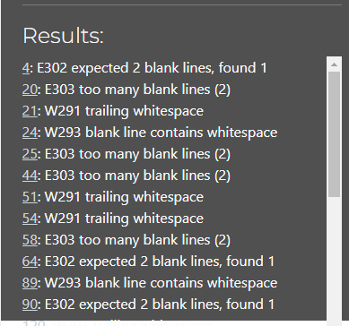

* After fixing the long line error messages, it has now improved. 
* Only lines that could break the code still remain. This will be fixed on future implementations.

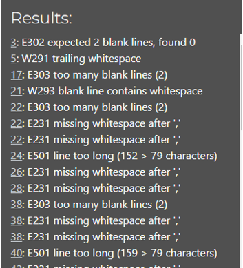

* Adding 2 new lines before defining the code and adding 1 line after the code has resolved most of the white space errors as shown on below screenshot:

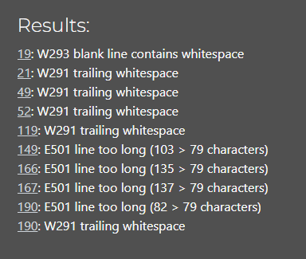

The rest of the trailing white spaces will be fixed on future implementations.

### Bugs
A board could not be created as it was not defined properly. It was not set properly

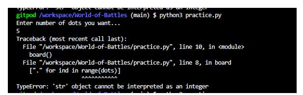

In order to check if the game is running, I had used a list as seen on the below screen shot to tell if the ships have been hit or not. I used ‘!’ exclamation marks as placeholders, however my Mentor advised I use a different legend for good user experience. Please see below for previous matrix:

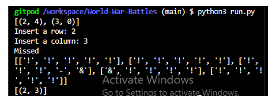

### Unfixed bug
- Player name validation.
    - When a player inserts something either than a string, the game continues. Please see screen below:

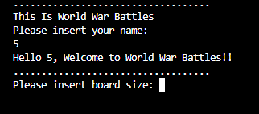

### Validator Testing
- No errors were returned from PEP8online.com

## Deployment
This project was deployed using Code Insitutte's mock terminal for Heroku.

- Steps for deployment:
    - Fork or clone this repository
    - Clone this project repository to use VS Code as workspace
    - Create a new Heroku App for all my project deployments
    - Set the buildbacks to Python and NodeJS in that order on Heroku app
    - Link the Heroku app to the repository
    - Click on Deploy to make my project live.

## Credits
* For a better understanding of creating a Battleships game [Knowledge Mavens](https://www.google.com/search?q=how+to+make+a+simple+battleship+game+in+python&sca_esv=8c3f90bc5e947fd3&ei=eBfoZq3IDoy0hbIPvszCkQU&oq=how+to+create+battleship+game+in+python&gs_lp=Egxnd3Mtd2l6LXNlcnAiJ2hvdyB0byBjcmVhdGUgYmF0dGxlc2hpcCBnYW1lIGluIHB5dGhvbioCCAEyBhAAGBYYHjIGEAAYFhgeMgsQABiABBiGAxiKBTILEAAYgAQYhgMYigUyCBAAGIAEGKIEMggQABiABBiiBDIIEAAYgAQYogQyCBAAGIAEGKIESLNjUOUGWJ8VcAF4AJABAJgBlwOgAaghqgEGMy0xMC4yuAEByAEA-AEBmAICoAKuA8ICChAAGLADGNYEGEeYAwCIBgGQBgiSBwUxLjQtMaAHpTs&sclient=gws-wiz-serp#fpstate=ive&vld=cid:3353d00c,vid:tF1WRCrd_HQ,st:0)
* Code Institute for the deployment terminal.
* Matt Rudge's Ultimate Battleships walkthrough for the structure of the game.
* Roman, Tutor CI, reminded me to call my functions in order for game to run
* Vusi Sibeko, former Code Institute student, with validating coordinates.
* Try and Error [W3School](https://www.w3schools.com/python/python_try_except.asp)
* About Battleships game [Battleship](https://en.wikipedia.org/wiki/Battleship_(game))

