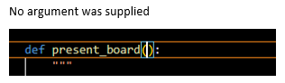
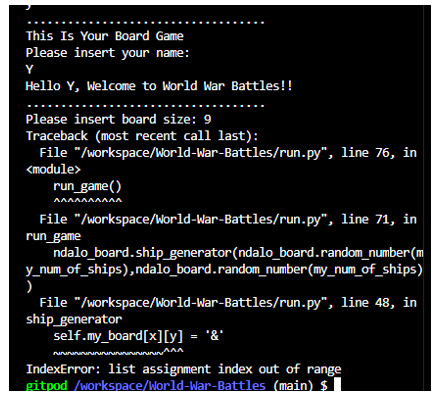

# World War BATTLES!

World War Battles is a Python terminal game, which runs in the Code Institute mock terminal on Heroku.

It is a single player game, where a player is playing against the computer to find its hidden ships. All ships have to be sunk to win the game.

[Here is the live version of my project](https://world-war-battles-c242ecc67e54.herokuapp.com/)

## How To Play Game

The game uses Legends which help a player know when a hit or miss takes place. A `X` is used to mark a hit, so when a ship is hit, the plaaceholder will be replaced by and `X`. A `&` marks the position in whic the ship is located. `O` is used as a placeholder. The `-` is used when a player missed the ship, and that means a loss.

The player as well as the computer take turns in guessing where the ship of the other is located in order to win. Once an oponent makes a correct guess, then they win. 

## Features

## Testing
* I have manually tested my code using PEP8 Python Validator.
* The results given: too many blank line, my code has many missing spaces after the ',' especially inside parenthesis's, and some lines are too long.

## Bugs

## Deployment
This project was deployed using Code Insitutte's mock terminal for Heroku.

- Steps for deployment:
    - Fork or clone this repository
    - Create a new Heroku App
    - Set the buildbacks to Python and NodeJS in that order
    - Link the Heroku app to the repository
    - Click on Deploy

## Credits
* For a better understanding of creating a Battleships game [Knowledge Mavens](https://www.google.com/search?q=how+to+make+a+simple+battleship+game+in+python&sca_esv=8c3f90bc5e947fd3&ei=eBfoZq3IDoy0hbIPvszCkQU&oq=how+to+create+battleship+game+in+python&gs_lp=Egxnd3Mtd2l6LXNlcnAiJ2hvdyB0byBjcmVhdGUgYmF0dGxlc2hpcCBnYW1lIGluIHB5dGhvbioCCAEyBhAAGBYYHjIGEAAYFhgeMgsQABiABBiGAxiKBTILEAAYgAQYhgMYigUyCBAAGIAEGKIEMggQABiABBiiBDIIEAAYgAQYogQyCBAAGIAEGKIESLNjUOUGWJ8VcAF4AJABAJgBlwOgAaghqgEGMy0xMC4yuAEByAEA-AEBmAICoAKuA8ICChAAGLADGNYEGEeYAwCIBgGQBgiSBwUxLjQtMaAHpTs&sclient=gws-wiz-serp#fpstate=ive&vld=cid:3353d00c,vid:tF1WRCrd_HQ,st:0)
* Code Institute for the deployment terminal.
* Matt Rudge's Ultimate Battleships walkthrough for the structure of the game.
